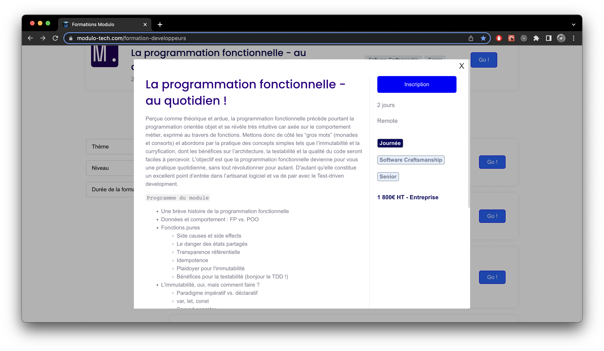

# 2022-04-19-meetup-fp

## Getting started

- **Fork**, then clone the repository
- Install dependencies (`npm i`)
- Start developing (`npm t`)

## FizzBuzz

### Problem statement

Write a program that prints the numbers from 1 to 100. But for multiples of three print “Fizz” instead of the number and for the multiples of five print “Buzz”. For numbers which are multiples of both three and five print “FizzBuzz”.

https://en.wikipedia.org/wiki/Fizz_buzz

### A working implementation

```typescript
const isMultipleOf = (m: number, n: number): boolean => n % m === 0;

export const replace = (n: number): string => {
  let result = "";

  if (isMultipleOf(3, n)) {
    result += "Fizz";
  }

  if (isMultipleOf(5, n)) {
    result += "Buzz";
  }

  return result || n.toString();
};

export const fizzBuzz = (n: number): string[] => {
  return [...Array(n)].map((_, i) => i + 1).map(replace);
};
```

### Let's start refactoring!

This code does work, but it is quite imperative: "do this, do that". We'd like to refactor it in a more declarative/functional way (we'll discuss what that mean).

Meanwhile, we'll cover important aspects of functional programming, including:

- Pure functions
- Function composition
- Curryfication
- And our special guest tonight: functors!

Ready steady go!

## Going further

Willing to learn more on the topic? Our 2-days training [La programmation fonctionnelle au quotidien!](https://modulo-tech.com/formation-developpeurs) is made for you!


